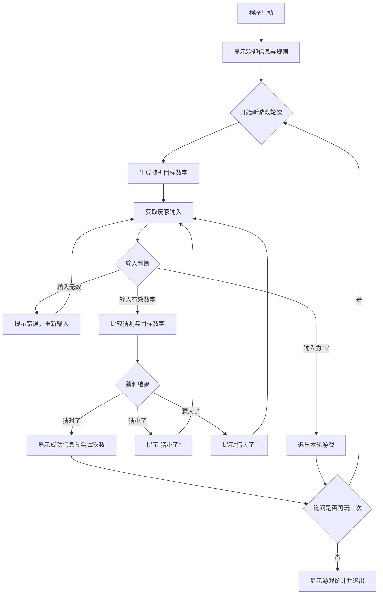

# Guess Number - 猜数字游戏

## 项目简介

**Guess Number** 是一个在终端（CLI）中运行的经典猜数字游戏。程序会随机生成一个 1 到 100 之间的整数，玩家通过输入数字进行猜测。每次猜测后，程序会提示“猜大了”或“猜小了”，引导玩家逐步接近正确答案，直到猜对为止。游戏支持多轮游玩，并会在结束时提供简单的游戏统计。

## 核心架构图

本项目是一个简单的单文件脚本，其核心逻辑是一个交互式的控制流循环。以下是其程序执行流程的示意图：



## 环境依赖

本项目为纯 Python 实现，无需任何 Web 框架或数据库。仅需标准的 Python 3 环境。

- **Python 版本**: 3.6 或更高版本
- **核心库**: `random` (Python 标准库)

无需安装任何第三方依赖包。

## 快速启动

1.  **获取代码**：将 `main.py` 文件保存到本地目录。
2.  **确保 Python 环境**：在终端中运行 `python --version` 或 `python3 --version` 确认 Python 版本符合要求。
3.  **运行游戏**：在终端中，切换到 `main.py` 文件所在目录，执行以下命令：

```bash
python main.py
```
或
```bash
python3 main.py
```

程序将立即启动，并显示欢迎界面。

## 接口说明

本项目是一个本地命令行程序，不提供任何 HTTP API 接口。所有交互均在终端内通过标准输入输出完成。

### 主要交互命令

在游戏运行过程中，你可以使用以下输入与程序交互：

| 输入时机 | 可输入内容 | 说明 |
| :--- | :--- | :--- |
| 猜测数字时 | `1` 到 `100` 之间的整数 | 提交你的猜测。 |
| 猜测数字时 | `q` | 放弃当前轮次的游戏，直接查看答案并进入“再玩一次”环节。 |
| 询问是否再玩一次时 | `y`, `yes`, `是` | 开始新一轮游戏。 |
| 询问是否再玩一次时 | `n`, `no`, `否` | 结束游戏，查看统计并退出程序。 |

### 运行示例

```
==================================================
欢迎来到猜数字游戏！
==================================================
游戏规则：
1. 程序会随机生成一个1到100之间的整数
2. 你需要猜测这个数字是多少
3. 每次猜测后，程序会告诉你猜大了还是猜小了
4. 直到你猜对为止
==================================================

第 1 轮游戏
------------------------------
我已经想好了一个1到100之间的数字，开始猜吧！

请输入你的猜测 (1-100)，或输入 'q' 退出游戏: 50
第1次尝试: 50 -> 猜小了！

请输入你的猜测 (1-100)，或输入 'q' 退出游戏: 75
第2次尝试: 75 -> 猜大了！

请输入你的猜测 (1-100)，或输入 'q' 退出游戏: 63
第3次尝试: 63 -> 猜对了！
你用了 3 次猜中了数字 63！
是否再玩一次？(y/n): n

==================================================
游戏统计：
总游戏轮数: 1
感谢游玩！再见！
==================================================
```