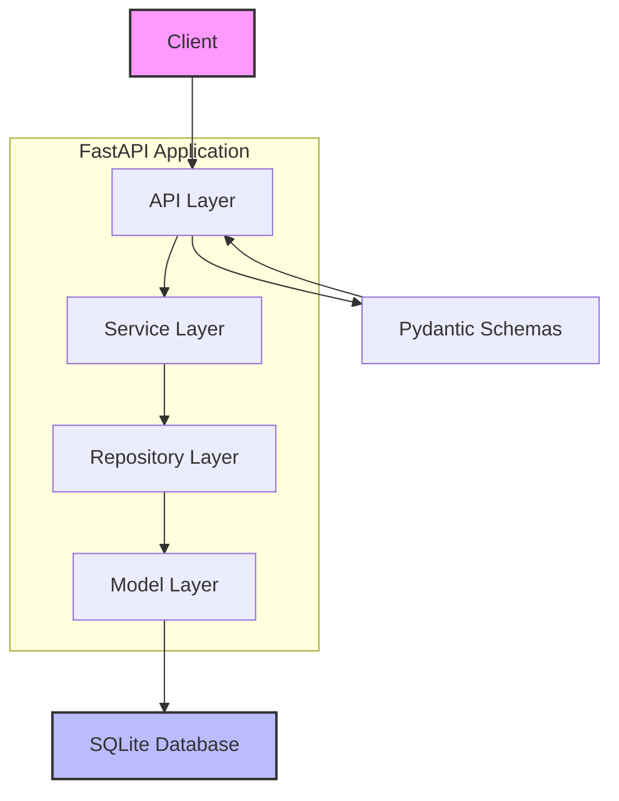

# My User Service

基于 FastAPI 构建的高性能用户管理后端服务，采用分层架构设计，提供完整的用户 CRUD 操作接口。

## 核心架构

```
┌─────────────────────────────────────────────────────────────┐
│                     Client / API Consumer                   │
└──────────────────────┬──────────────────────────────────────┘
                       │ HTTP Request/Response
                       ▼
┌─────────────────────────────────────────────────────────────┐
│                    API Layer (main.py)                       │
│              FastAPI Router / Endpoint Handlers              │
└──────────────────────┬──────────────────────────────────────┘
                       │
                       ▼
┌─────────────────────────────────────────────────────────────┐
│                  Service Layer (main.py)                     │
│              Business Logic / Validation Logic               │
└──────────────────────┬──────────────────────────────────────┘
                       │
                       ▼
┌─────────────────────────────────────────────────────────────┐
│                   Repository Layer (main.py)                 │
│              SQLAlchemy ORM / Database Operations            │
└──────────────────────┬──────────────────────────────────────┘
                       │
                       ▼
┌─────────────────────────────────────────────────────────────┐
│                    Model Layer (models.py)                   │
│              SQLAlchemy Models / Database Schema             │
└──────────────────────┬──────────────────────────────────────┘
                       │
                       ▼
┌─────────────────────────────────────────────────────────────┐
│                    SQLite Database (app.db)                  │
└─────────────────────────────────────────────────────────────┘
```

### 架构说明



## 环境依赖

### 系统要求
- Python 3.8+
- pip 包管理器

### 依赖清单

| 依赖 | 版本要求 | 用途 |
|------|---------|------|
| fastapi | >=0.100.0 | Web 框架 |
| uvicorn | >=0.23.0 | ASGI 服务器 |
| sqlalchemy | >=2.0.0 | ORM 框架 |
| pydantic | >=2.0.0 | 数据验证 |
| pydantic[email] | >=2.0.0 | 邮箱验证 |

## 安装步骤

### 1. 克隆项目

```bash
git clone <repository-url>
cd my_user_service
```

### 2. 创建虚拟环境（推荐）

```bash
python -m venv venv
source venv/bin/activate  # Linux/Mac
# 或
venv\Scripts\activate     # Windows
```

### 3. 安装依赖

```bash
pip install fastapi uvicorn sqlalchemy pydantic pydantic[email]
```

### 4. 验证安装

```bash
python -c "import fastapi; print(f'FastAPI {fastapi.__version__} installed successfully')"
```

## 快速启动

### 启动服务

```bash
# 开发模式（热重载）
uvicorn app.main:app --reload --host 0.0.0.0 --port 8000

# 生产模式
uvicorn app.main:app --host 0.0.0.0 --port 8000 --workers 4
```

### 访问接口

- API 文档：http://localhost:8000/docs
- 交互式文档：http://localhost:8000/redoc
- 健康检查：http://localhost:8000/users

## 接口说明

### 1. 获取用户列表

```http
GET /users
```

**响应示例：**
```json
{
  "users": [
    {
      "id": 1,
      "username": "john_doe",
      "email": "john@example.com",
      "full_name": "John Doe",
      "is_active": true,
      "created_at": "2024-01-01T00:00:00",
      "updated_at": "2024-01-01T00:00:00"
    }
  ],
  "total": 1
}
```

**curl 示例：**
```bash
curl -X GET "http://localhost:8000/users" \
  -H "accept: application/json"
```

### 2. 创建用户

```http
POST /users
```

**请求体：**
```json
{
  "username": "john_doe",
  "email": "john@example.com",
  "password": "secure_password",
  "full_name": "John Doe"
}
```

**响应状态码：** 201 Created

**curl 示例：**
```bash
curl -X POST "http://localhost:8000/users" \
  -H "Content-Type: application/json" \
  -d '{
    "username": "john_doe",
    "email": "john@example.com",
    "password": "secure_password",
    "full_name": "John Doe"
  }'
```

### 3. 获取单个用户

```http
GET /users/{user_id}
```

**路径参数：**
| 参数 | 类型 | 描述 |
|------|------|------|
| user_id | integer | 用户唯一标识 |

**curl 示例：**
```bash
curl -X GET "http://localhost:8000/users/1" \
  -H "accept: application/json"
```

### 4. 更新用户

```http
PUT /users/{user_id}
```

**请求体（部分更新）：**
```json
{
  "full_name": "John Updated",
  "is_active": true
}
```

**curl 示例：**
```bash
curl -X PUT "http://localhost:8000/users/1" \
  -H "Content-Type: application/json" \
  -d '{
    "full_name": "John Updated",
    "is_active": true
  }'
```

### 5. 删除用户

```http
DELETE /users/{user_id}
```

**响应状态码：** 204 No Content

**curl 示例：**
```bash
curl -X DELETE "http://localhost:8000/users/1" \
  -H "accept: application/json"
```

## 错误处理

| 状态码 | 含义 | 说明 |
|--------|------|------|
| 200 | OK | 请求成功 |
| 201 | Created | 资源创建成功 |
| 204 | No Content | 删除成功 |
| 404 | Not Found | 用户不存在 |
| 409 | Conflict | 用户名或邮箱冲突 |
| 422 | Unprocessable Entity | 请求数据验证失败 |

## 项目结构

```
my_user_service/
├── app/
│   ├── __init__.py
│   ├── main.py          # FastAPI 应用入口
│   ├── models.py        # SQLAlchemy 数据模型
│   ├── schemas.py       # Pydantic 数据验证模型
│   └── database.py      # 数据库配置
├── app.db               # SQLite 数据库文件（自动生成）
├── requirements.txt     # 依赖清单
└── README.md            # 项目文档
```

## 开发说明

### 密码安全
当前实现中密码以明文存储，生产环境应使用 `passlib` 或 `bcrypt` 进行密码哈希处理。

### 数据库迁移
对于生产环境，建议使用 Alembic 进行数据库迁移管理。

### 测试
```bash
# 安装测试依赖
pip install pytest httpx

# 运行测试
pytest tests/
```

## 许可证

MIT License