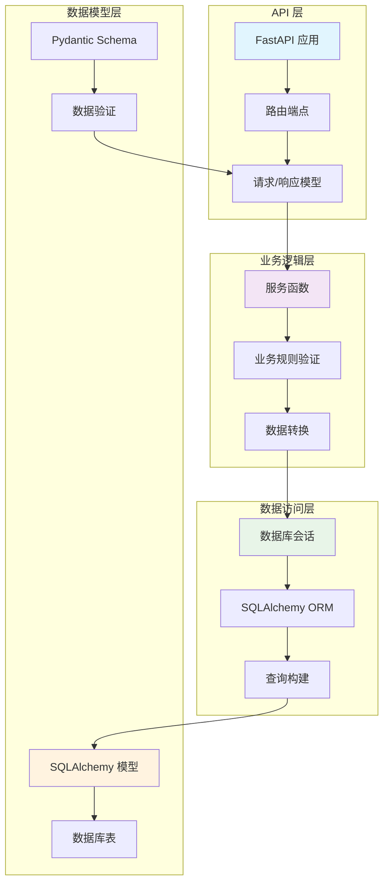

# my_user_service

## 项目简介

my_user_service 是一个基于 FastAPI 构建的现代化用户管理后端服务。该项目采用分层架构设计，实现了完整的用户 CRUD 操作，包括用户创建、查询、更新和软删除功能。服务使用 SQLite 作为数据库，通过 SQLAlchemy ORM 进行数据操作，并利用 Pydantic 模型进行数据验证和序列化。

## 核心架构图



## 环境依赖与安装步骤

### 前置要求
- Python 3.8+
- pip 包管理器

### 安装步骤

1. **克隆项目**
   ```bash
   git clone <repository-url>
   cd my_user_service
   ```

2. **创建虚拟环境（推荐）**
   ```bash
   python -m venv venv
   source venv/bin/activate  # Linux/Mac
   # 或
   venv\Scripts\activate     # Windows
   ```

3. **安装依赖**
   ```bash
   pip install -r requirements.txt
   ```

## 快速启动命令

1. **启动开发服务器**
   ```bash
   uvicorn app.main:app --reload --host 0.0.0.0 --port 8000
   ```

2. **访问 API 文档**
   - Swagger UI: http://localhost:8000/docs
   - ReDoc: http://localhost:8000/redoc

3. **验证服务运行状态**
   ```bash
   curl http://localhost:8000/
   ```

## 接口说明与 curl 示例

### 1. 获取服务状态
**端点**: `GET /`

**curl 示例**:
```bash
curl -X GET "http://localhost:8000/"
```

### 2. 获取用户列表
**端点**: `GET /users`
**查询参数**:
- `skip`: 跳过的记录数（默认: 0）
- `limit`: 返回的最大记录数（默认: 100，最大: 100）

**curl 示例**:
```bash
curl -X GET "http://localhost:8000/users?skip=0&limit=10"
```

### 3. 创建新用户
**端点**: `POST /users`
**请求体**:
```json
{
  "username": "john_doe",
  "email": "john@example.com",
  "full_name": "John Doe",
  "password": "securepassword123"
}
```

**curl 示例**:
```bash
curl -X POST "http://localhost:8000/users" \
  -H "Content-Type: application/json" \
  -d '{
    "username": "john_doe",
    "email": "john@example.com",
    "full_name": "John Doe",
    "password": "securepassword123"
  }'
```

### 4. 获取指定用户
**端点**: `GET /users/{user_id}`
**路径参数**:
- `user_id`: 用户 ID

**curl 示例**:
```bash
curl -X GET "http://localhost:8000/users/1"
```

### 5. 更新用户信息
**端点**: `PUT /users/{user_id}`
**路径参数**:
- `user_id`: 用户 ID

**请求体（部分更新示例）**:
```json
{
  "full_name": "John Smith",
  "email": "john.smith@example.com"
}
```

**curl 示例**:
```bash
curl -X PUT "http://localhost:8000/users/1" \
  -H "Content-Type: application/json" \
  -d '{
    "full_name": "John Smith",
    "email": "john.smith@example.com"
  }'
```

### 6. 删除用户（软删除）
**端点**: `DELETE /users/{user_id}`
**路径参数**:
- `user_id`: 用户 ID

**注意**: 此操作为软删除，仅将用户的 `is_active` 字段设置为 `false`

**curl 示例**:
```bash
curl -X DELETE "http://localhost:8000/users/1"
```

## 项目结构

```
my_user_service/
├── app/
│   ├── __init__.py
│   ├── main.py           # FastAPI 应用入口
│   ├── models.py         # SQLAlchemy 数据模型
│   ├── schemas.py        # Pydantic 数据验证模型
│   └── database.py       # 数据库配置和会话管理
├── requirements.txt      # 项目依赖
├── my_user_service.db    # SQLite 数据库文件（自动生成）
└── README.md            # 项目文档
```

## 数据模型

### User 表结构
| 字段名 | 类型 | 描述 |
|--------|------|------|
| id | Integer | 主键，自增 |
| username | String(50) | 用户名，唯一索引 |
| email | String(100) | 邮箱地址，唯一索引 |
| full_name | String(100) | 全名（可选） |
| hashed_password | String(255) | 哈希后的密码 |
| is_active | Boolean | 用户激活状态 |
| created_at | DateTime | 创建时间 |
| updated_at | DateTime | 更新时间 |

## 注意事项

1. **密码安全**: 当前实现中密码哈希处理为简化版本，生产环境应使用 `bcrypt` 或 `argon2` 等安全哈希算法
2. **数据库**: 默认使用 SQLite 文件数据库，生产环境建议迁移到 PostgreSQL 或 MySQL
3. **分页**: 用户列表接口支持分页，最大返回 100 条记录
4. **软删除**: 删除操作仅标记用户为未激活状态，数据仍保留在数据库中

## 开发说明

- 数据库表会在应用启动时自动创建
- 开发模式下 SQLAlchemy 会输出所有 SQL 语句（可通过设置 `echo=False` 关闭）
- 所有 API 端点都支持 Swagger UI 和 ReDoc 文档
- 数据验证通过 Pydantic 模型自动处理

## 故障排除

1. **端口冲突**: 如果 8000 端口被占用，可通过 `--port` 参数指定其他端口
2. **数据库连接错误**: 确保有写入权限，可删除 `my_user_service.db` 文件后重启服务
3. **导入错误**: 确保在项目根目录下运行，或正确设置 Python 路径

## 许可证

本项目仅供学习参考，可根据实际需求进行修改和使用。