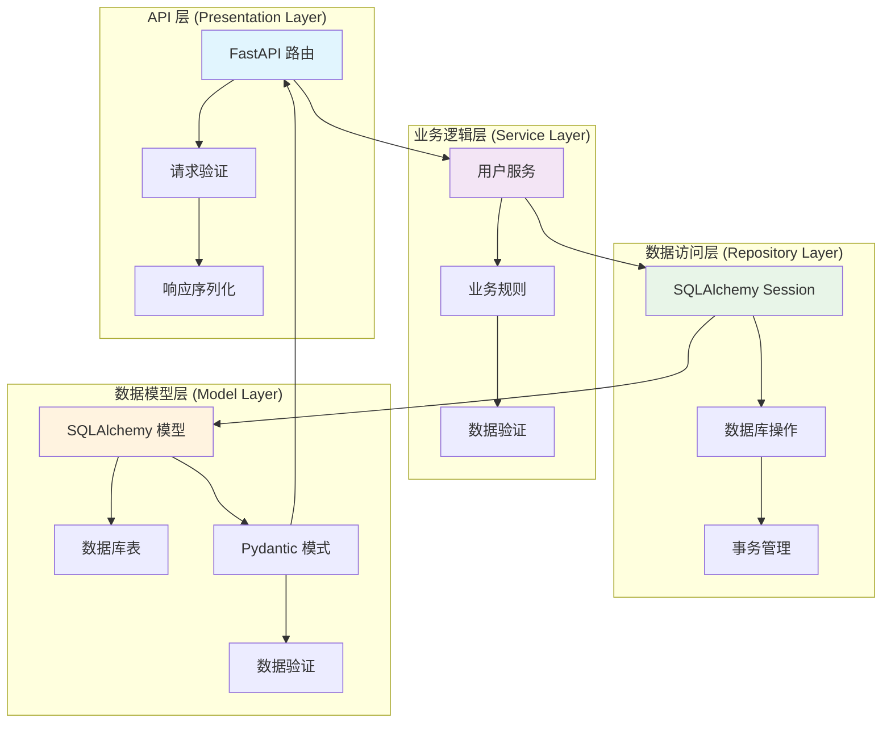

# my_user_service

## 项目简介

my_user_service 是一个基于 FastAPI 构建的现代化、高性能用户管理后端服务。该项目采用分层架构设计，实现了完整的用户 CRUD（创建、读取、更新、删除）操作，并提供了 RESTful API 接口。服务使用 SQLite 作为数据库，通过 SQLAlchemy ORM 进行数据操作，Pydantic 进行数据验证和序列化。

## 核心架构

本项目采用经典的四层架构设计，确保代码的清晰分离和可维护性：



## 环境依赖与安装

### 系统要求
- Python 3.8+
- pip 包管理器

### 安装步骤

1. **克隆项目**
   ```bash
   git clone <repository-url>
   cd my_user_service
   ```

2. **创建虚拟环境（推荐）**
   ```bash
   python -m venv venv
   # Windows
   venv\Scripts\activate
   # Linux/Mac
   source venv/bin/activate
   ```

3. **安装依赖**
   ```bash
   pip install -r requirements.txt
   ```

4. **初始化数据库**
   ```bash
   # 首次运行应用时会自动创建数据库表
   python -m app.main
   ```

## 快速启动

### 启动开发服务器
```bash
uvicorn app.main:app --reload --host 0.0.0.0 --port 8000
```

### 访问 API 文档
启动服务后，可以通过以下地址访问交互式 API 文档：
- Swagger UI: http://localhost:8000/docs
- ReDoc: http://localhost:8000/redoc

### 运行测试
```bash
# 运行所有测试
pytest tests/

# 运行特定测试文件
pytest tests/test_main.py

# 显示详细测试输出
pytest -v
```

## 接口说明

### 用户管理 API

#### 1. 获取用户列表
**GET** `/users`

查询参数：
- `skip` (可选): 跳过的记录数，默认 0
- `limit` (可选): 返回的最大记录数，默认 100

**cURL 示例：**
```bash
curl -X GET "http://localhost:8000/users?skip=0&limit=10" \
     -H "Content-Type: application/json"
```

#### 2. 创建用户
**POST** `/users`

请求体：
```json
{
  "username": "john_doe",
  "email": "john@example.com",
  "full_name": "John Doe",
  "password": "secure_password123",
  "is_active": true
}
```

**cURL 示例：**
```bash
curl -X POST "http://localhost:8000/users" \
     -H "Content-Type: application/json" \
     -d '{
       "username": "john_doe",
       "email": "john@example.com",
       "full_name": "John Doe",
       "password": "secure_password123",
       "is_active": true
     }'
```

#### 3. 获取单个用户
**GET** `/users/{id}`

路径参数：
- `id`: 用户 ID

**cURL 示例：**
```bash
curl -X GET "http://localhost:8000/users/1" \
     -H "Content-Type: application/json"
```

#### 4. 更新用户
**PUT** `/users/{id}`

路径参数：
- `id`: 用户 ID

请求体（支持部分更新）：
```json
{
  "username": "updated_username",
  "email": "updated@example.com",
  "full_name": "Updated Name",
  "password": "new_password",
  "is_active": false
}
```

**cURL 示例：**
```bash
curl -X PUT "http://localhost:8000/users/1" \
     -H "Content-Type: application/json" \
     -d '{
       "username": "updated_username",
       "email": "updated@example.com",
       "full_name": "Updated Name"
     }'
```

#### 5. 删除用户
**DELETE** `/users/{id}`

路径参数：
- `id`: 用户 ID

**cURL 示例：**
```bash
curl -X DELETE "http://localhost:8000/users/1" \
     -H "Content-Type: application/json"
```

### 响应格式
所有成功响应都遵循以下格式：
```json
{
  "id": 1,
  "username": "john_doe",
  "email": "john@example.com",
  "full_name": "John Doe",
  "is_active": true,
  "created_at": "2024-01-01T12:00:00Z",
  "updated_at": "2024-01-01T12:00:00Z"
}
```

### 错误处理
服务返回标准 HTTP 状态码：
- `200 OK`: 请求成功
- `201 Created`: 资源创建成功
- `204 No Content`: 删除成功
- `400 Bad Request`: 请求参数错误或数据冲突
- `404 Not Found`: 资源不存在
- `500 Internal Server Error`: 服务器内部错误

## 项目结构
```
my_user_service/
├── app/
│   ├── __init__.py
│   ├── main.py           # FastAPI 应用入口和路由
│   ├── models.py         # SQLAlchemy 数据模型
│   ├── schemas.py        # Pydantic 数据模式
│   └── database.py       # 数据库配置和会话管理
├── tests/
│   └── test_main.py      # API 测试用例
├── requirements.txt      # 项目依赖
├── README.md            # 项目文档
└── my_user_service.db   # SQLite 数据库文件（运行后生成）
```

## 安全说明

⚠️ **重要安全提示**

当前版本使用简化密码哈希处理（仅添加 "_hashed" 后缀），**不适用于生产环境**。在生产部署前，必须：

1. 使用安全的密码哈希算法（如 bcrypt、Argon2）
2. 添加适当的密码强度验证
3. 实现 HTTPS 加密传输
4. 添加身份验证和授权机制
5. 配置适当的 CORS 策略

## 开发说明

### 数据库迁移
对于生产环境，建议使用 Alembic 进行数据库迁移管理：
```bash
# 安装 Alembic
pip install alembic

# 初始化迁移环境
alembic init migrations

# 创建迁移脚本
alembic revision --autogenerate -m "Initial migration"

# 应用迁移
alembic upgrade head
```

### 配置管理
当前使用硬编码配置，建议使用环境变量或配置文件：
```python
import os

SQLALCHEMY_DATABASE_URL = os.getenv(
    "DATABASE_URL", 
    "sqlite:///./my_user_service.db"
)
```

### 性能优化
- 生产环境应将 `echo=True` 改为 `False` 以减少日志输出
- 考虑使用连接池管理数据库连接
- 实现适当的缓存策略
- 添加 API 限流和请求频率限制

## 许可证

本项目采用 MIT 许可证。详见 LICENSE 文件。