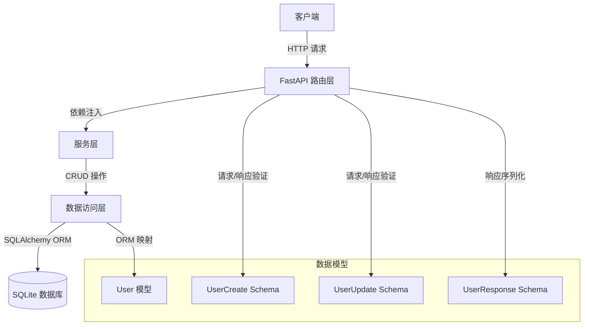

# My User Service

基于 FastAPI 的后端服务，提供用户管理功能，包括用户的创建、查询、更新和删除操作。

## 核心架构图



## 环境依赖

### 创建虚拟环境

```bash
# 创建虚拟环境
python -m venv venv

# 激活虚拟环境
# Windows
venv\Scripts\activate
# Linux/Mac
source venv/bin/activate
```

### 安装依赖

```bash
pip install fastapi uvicorn sqlalchemy pydantic
```

## 快速启动

```bash
# 启动服务
uvicorn app.main:app --reload --host 0.0.0.0 --port 8000
```

服务启动后，访问 http://localhost:8000/docs 查看交互式 API 文档。

## 接口说明

### 1. 获取所有用户

```bash
curl -X GET "http://localhost:8000/users" \
  -H "accept: application/json"
```

### 2. 创建用户

```bash
curl -X POST "http://localhost:8000/users" \
  -H "Content-Type: application/json" \
  -d '{
    "username": "张三",
    "email": "zhangsan@example.com",
    "favorite_fruits": ["苹果", "香蕉"]
  }'
```

### 3. 获取单个用户

```bash
curl -X GET "http://localhost:8000/users/1" \
  -H "accept: application/json"
```

### 4. 更新用户

```bash
curl -X PUT "http://localhost:8000/users/1" \
  -H "Content-Type: application/json" \
  -d '{
    "username": "李四",
    "email": "lisi@example.com",
    "favorite_fruits": ["橙子", "葡萄"]
  }'
```

### 5. 删除用户

```bash
curl -X DELETE "http://localhost:8000/users/1" \
  -H "accept: application/json"
```